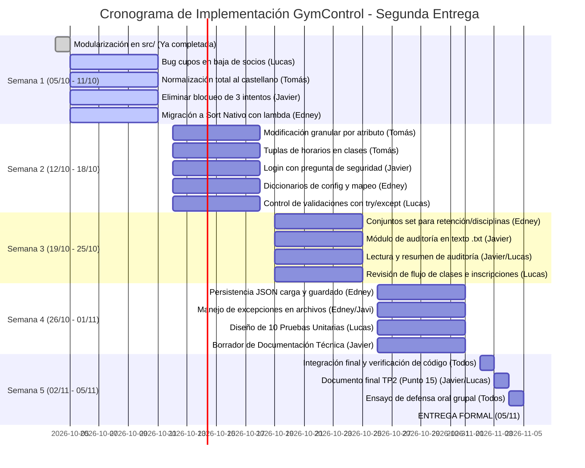

# Plan de Trabajo y Cronograma de Implementación - GymControl (Segunda Parte)

**Materia:** Algoritmos y Estructura de Datos 1 / Programación 1  
**Institución:** Universidad Argentina de la Empresa (UADE)  
**Año y Cuatrimestre:** 2026 - 2.º Cuatrimestre (Lunes por la noche - N.º 577502)  
**Docentes:** Lic. Gustavo E. Escandell y Lic. Facundo Marianelli  
**Fecha Límite de Entrega:** **05 de Noviembre de 2026**  
**Fecha de Inicio del Plan:** 05 de Octubre de 2026 (Duración: 5 semanas)

---

## 1. Composición del Equipo y Distribución de Roles

Tras la desvinculación de Rodrigo García Solá, el grupo queda conformado por **4 integrantes**. Se redistribuyen las responsabilidades de forma equitativa considerando las fortalezas de cada uno y la modularización inicial ya ejecutada:

| Integrante | Rama Git | Responsabilidad Principal en la 2.ª Parte |
|---|---|---|
| **Lucas Cragaris** | `dev-lucas` | **Arquitectura modular inicial (completada)** + Corrección crítica de liberación de cupos en bajas + Módulo de inscripciones y suite de Pruebas Unitarias. |
| **Javier Candalaft** | `dev-canda` | Reformulación del sistema de autenticación (quitar bloqueo de 3 intentos + login alternativo con pregunta de seguridad) + Módulo de auditoría en texto (`.txt`) + Documentación. |
| **Tomás van Nynatten** | `dev-tom` | Menú interactivo de modificación granular por atributo (socios y clases) + Normalización total del código al castellano + Implementación de Tuplas (`tuple`). |
| **Edney Ribeiro** | `dev-ed` | Reemplazo por ordenamientos nativos (`sorted` / `key=lambda`) + Aplicación de Conjuntos (`set`) y Diccionarios (`dict`) + Persistencia integral en formato JSON (`.json`). |

---

## 2. Relevamiento de Tareas: Correcciones y Nuevos Requisitos

### 2.1 Correcciones Docentes (Devolución Escrita y Exposición Oral)
1. **[Urgente] Liberación de cupos al dar de baja un afiliado:** Al eliminar un socio con inscripciones activas, se debe restituir automáticamente el cupo en las clases involucradas.
2. **Menú de modificación granular:** Permitir al usuario elegir qué campo modificar (ej. solo edad, solo teléfono) en lugar de solicitar todos los datos consecutivamente.
3. **Uso de Sort nativo de Python:** Reemplazar los ordenamientos manuales (burbujeo, inserción, selección) por `sorted(..., key=lambda ...)`.
4. **Normalización total al castellano:** Traducir variables, constantes y nombres de funciones que quedaron en inglés.
5. **Eliminar bloqueo tras 3 intentos:** Quitar la interrupción forzada en el login para dar reintentos guiados.
6. **Método alternativo de login por pregunta secreta:** Agregar pregunta y respuesta de seguridad por usuario como vía alternativa de acceso.

### 2.2 Requisitos Oficiales del TP - Segunda Parte (PDF Consigna)
* **Conjuntos (`set`):** Mínimo un uso con utilidad concreta justificada (análisis de socios sin clases activas / disciplinas únicas).
* **Tuplas (`tuple`):** Mínimo una tupla para datos inmutables agrupados (horarios fijos de clases `(dias, hora_inicio, hora_fin)`).
* **Diccionarios (`dict`):** Gestión de configuraciones, mapeos rápidos y conteos de auditoría/estadísticas.
* **Manejo de Excepciones (`try / except`):** Control de entradas numéricas erróneas (`ValueError`) y fallas de E/S en archivos (`FileNotFoundError`, `JSONDecodeError`, `IOError`).
* **Archivos de Texto (`.txt`):** Registro cronológico de auditoría (`auditoria.txt`) con lectura y utilización de resumen.
* **Archivos JSON (`.json`):** Persistencia completa del estado del gimnasio (`datos_gimnasio.json`) con ciclo de vida carga/modificación/guardado.
* **Pruebas Unitarias:** 10 pruebas automatizadas sobre al menos 5 funciones (4 válidas, 3 inválidas, 2 límites y 1 caso de negocio relevante).
* **Restricciones Técnicas Absolutas:** **PROHIBIDO EL USO DE CLASES (`class`)**, bases de datos y librerías externas.

---

## 3. Cronograma Semanal de Trabajo (05/10 al 05/11)

---

### Detalle de Actividades por Semana

#### Semana 1: Correcciones Críticas de la 1.ª Entrega y Normalización (05/10 - 11/10)
*Objetivo:* Sanear el código base recién modularizado resolviendo las observaciones directas de los profesores.
* **Lucas:**
  - **Tarea:** Corregir en `src/socios.py` la función de eliminación de afiliados para que, al borrar las inscripciones activas (`estado == 1`), busque la clase correspondiente e incremente sus cupos disponibles (`cupos += 1`).
  - **Entregable:** Función probada con el caso exacto de la devolución docente (dar de alta a socio 112 en clase 201, eliminar socio 112 y constatar que clase 201 vuelva a 15 cupos).
* **Tomás:**
  - **Tarea:** Normalizar el idioma al castellano en los nombres de variables, constantes y funciones de `src/datos.py`, `src/socios.py`, `src/clases.py` e `src/inscripciones.py` (`affiliates` $\to$ `socios`, `search_affiliate_position` $\to$ `buscar_posicion_socio`, etc.).
  - **Entregable:** Pull Request con nomenclaturas homogéneas en español.
* **Javier:**
  - **Tarea:** Modificar `src/login.py` para remover la condición de corte que bloquea el sistema tras 3 intentos erróneos. Permitir reintentos con opción voluntaria de salir.
  - **Entregable:** Login interactivo sin bloqueo forzado.
* **Edney:**
  - **Tarea:** En `src/ordenamientos.py`, reemplazar los algoritmos manuales de burbujeo, selección e inserción por el ordenamiento nativo `sorted(coleccion, key=lambda ...)` para socios, clases e inscripciones.
  - **Entregable:** Tres funciones de ordenamiento optimizadas mediante Timsort nativo.

---

#### Semana 2: Modificación Granular, Tuplas, Diccionarios y Seguridad (12/10 - 18/10)
*Objetivo:* Incorporar la navegación granular pedida en la exposición y las estructuras de datos inmutables y asociativas.
* **Tomás:**
  - **Tarea 1:** Desarrollar en `src/socios.py` y `src/clases.py` el submenú interactivo para modificar atributos de a uno por vez (1. Nombre, 2. Edad, 3. Tipo, etc., 0. Salir).
  - **Tarea 2:** Incorporar la **Tupla (`tuple`)** en cada registro de clase para representar el bloque horario inmutable `(dias, hora_inicio, hora_fin)`.
  - **Entregable:** Modificación selectiva funcionando y clases enriquecidas con tuplas.
* **Javier:**
  - **Tarea:** Implementar el método alternativo de autenticación por pregunta de seguridad en `src/login.py`. Cada usuario cuenta con una pregunta secreta y respuesta asociada.
  - **Entregable:** Menú de inicio de sesión con opción 1 (contraseña) y opción 2 (pregunta secreta).
* **Edney:**
  - **Tarea:** Crear el diccionario de configuración del gimnasio (`src/datos.py`) y estructurar los catálogos de tipos de socio y niveles como diccionarios (`dict`) para búsquedas directas $O(1)$.
  - **Entregable:** Diccionarios integrados con los menús de consulta.
* **Lucas:**
  - **Tarea:** Enriquecer `src/validaciones.py` con manejo de excepciones `try / except ValueError` para la captura de enteros y flotantes, evitando caídas ante entradas alfanuméricas.
  - **Entregable:** Módulo de validaciones blindado con `try/except`.

---

#### Semana 3: Conjuntos (`set`) y Archivos de Texto (`.txt`) (19/10 - 25/10)
*Objetivo:* Desarrollar los casos prácticos de conjuntos y el sistema de auditoría en texto plano.
* **Edney:**
  - **Tarea:** Desarrollar en `src/estadisticas.py` dos funcionalidades basadas en **Conjuntos (`set`)**:
    1. Reporte de socios sin clases activas mediante diferencia de sets: `set(todos_los_socios) - set(socios_con_clases_activas)`.
    2. Extracción de disciplinas únicas ofrecidas sin duplicados (`set(nombres_clases)`).
  - **Entregable:** Reporte de retención comercial y catálogo único mediante operaciones de conjuntos.
* **Javier:**
  - **Tarea:** Crear el subsistema de auditoría en texto plano (`auditoria.txt`). Diseñar la función `registrar_auditoria(operacion, detalle)` para registrar altas, bajas, modificaciones y accesos con timestamp.
  - **Entregable:** Generación y escritura incremental del archivo `auditoria.txt`.
* **Lucas y Javier:**
  - **Tarea:** Implementar la lectura y procesamiento posterior de `auditoria.txt`, contabilizando eventos mediante un diccionario y exponiendo un resumen en el menú.
  - **Entregable:** Opción en el menú para consultar el historial de operaciones del gimnasio.
* **Tomás:**
  - **Tarea:** Aplicar la modificación granular a las inscripciones en `src/inscripciones.py` (permitir modificar solo asistencias o solo estado activa/inactiva cuidando el cupo).
  - **Entregable:** CRUD de inscripciones 100% granular y validado.

---

#### Semana 4: Persistencia JSON (`.json`) y Pruebas Unitarias (26/10 - 01/11)
*Objetivo:* Completar el ciclo de vida de persistencia en disco y automatizar la batería de testing.
* **Edney:**
  - **Tarea:** Crear el módulo de persistencia JSON (`src/persistencia.py`):
    - `cargar_datos_json()`: lee `datos_gimnasio.json` con control de `FileNotFoundError` y `JSONDecodeError`.
    - `guardar_datos_json()`: serializa el estado completo en `.json` al salir del sistema o bajo demanda.
  - **Entregable:** Persistencia real entre ejecuciones sucesivas del programa.
* **Lucas:**
  - **Tarea:** Desarrollar la suite independiente de **10 Pruebas Unitarias** (`test_gymcontrol.py`):
    - 4 casos válidos (teléfono, nombre con tilde, socio inscripto, usuario case-insensitive).
    - 3 casos inválidos (teléfono sin guiones, nombre con números, socio inactivo).
    - 2 casos límite (edad exacta en 14 años y edad fuera de rango en 13 años).
    - 1 caso de negocio relevante (comprobación de liberación de cupos al dar de baja a un socio).
    - *Nota técnica:* Programar la suite de forma funcional/procedimental sin usar la palabra reservada `class` para no violar la restricción técnica 12.1.
  - **Entregable:** Archivo de tests ejecutable de manera independiente con salida formateada.
* **Javier:**
  - **Tarea:** Redactar el borrador del documento explicativo de entrega según los ítems obligatorios del punto 15 del enunciado (mejoras, estructuras, persistencia, excepciones, tests).
  - **Entregable:** Estructura completa de la documentación técnica.

---

#### Semana 5: Integración, Documentación Final y Ensayo de Defensa (02/11 - 05/11)
*Objetivo:* Control de calidad integral, congelamiento de código, armado del paquete de entrega y preparación para la defensa oral.
* **Todos (Lucas, Javier, Tomás, Edney):**
  - **Lunes 02/11 (Clase presencial / virtual):**
    - Despejar últimas dudas con los docentes.
    - Code Review grupal: verificar que **no exista ninguna clase (`class`)**, ninguna base de datos ni librerías fuera de la currícula.
  - **Martes 03/11:**
    - Consolidación en la rama principal (`main`).
    - Verificación del correcto funcionamiento de `datos_gimnasio.json`, `auditoria.txt` y `test_gymcontrol.py` en computadoras distintas.
  - **Miércoles 04/11:**
    - Finalización del documento explicativo en PDF/Markdown ([`Documentacion_TP2.md`](file:///c:/Users/lucas/OneDrive/Escritorio/UADE/2026/Segundo%20cuatrimestre/1.%20Algoritmos/GymControl/GymControl/Documentacion/Documentacion_Modularizacion.md)).
    - **Simulacro de defensa oral:** Cada integrante practica explicar su función asignada, justificar la estructura de datos utilizada y realizar modificaciones en vivo solicitadas por el docente.
  - **Jueves 05/11 (FECHA DE ENTREGA):**
    - Subida del repositorio final y entrega formal en la plataforma de UADE.

---

## 4. Matriz de Trazabilidad y Asignación de Responsabilidades

| Requisito Académico / Corrección | Responsable Principal | Archivo / Módulo Involucrado | Semana |
|---|---|---|---|
| **Modularización del sistema** | Lucas (Completado) | `src/` (todos los módulos) | Semana 1 |
| **Corrección: Liberación de cupos** | Lucas | `src/socios.py` | Semana 1 |
| **Corrección: Todo en castellano** | Tomás | `src/*.py` | Semana 1 |
| **Corrección: Fin bloqueo 3 intentos** | Javier | `src/login.py` | Semana 1 |
| **Corrección: Sorts nativos** | Edney | `src/ordenamientos.py` | Semana 1 |
| **Corrección: Modificación granular** | Tomás | `src/socios.py`, `src/clases.py` | Semana 2 |
| **Corrección: Login pregunta secreta** | Javier | `src/login.py` | Semana 2 |
| **Tuplas (`tuple`)** | Tomás | `src/clases.py`, `src/datos.py` | Semana 2 |
| **Diccionarios (`dict`)** | Edney | `src/datos.py`, `src/estadisticas.py` | Semana 2 |
| **Excepciones (`try / except`)** | Lucas / Edney | `src/validaciones.py`, `src/persistencia.py` | Semanas 2 y 4 |
| **Conjuntos (`set`)** | Edney | `src/estadisticas.py` | Semana 3 |
| **Archivos de texto (`.txt`)** | Javier | `src/persistencia.py`, `auditoria.txt` | Semana 3 |
| **Archivos JSON (`.json`)** | Edney | `src/persistencia.py`, `datos_gimnasio.json`| Semana 4 |
| **10 Pruebas Unitarias** | Lucas | `test_gymcontrol.py` | Semana 4 |
| **Documentación Punto 15** | Javier / Lucas | `Documentacion_TP2.md` | Semanas 4 y 5 |
| **Defensa y Entrega Final** | Todos | Repositorio general | Semana 5 (05/11) |

---

## 5. Recomendaciones Clave para la Defensa Oral

El punto 17 de la consigna establece que el docente evaluará a los integrantes pidiéndoles explicar y modificar código en vivo:
1. **Comprensión transversal:** Aunque cada integrante tenga tareas asignadas, todos deben conocer la interacción completa entre módulos.
2. **Justificación conceptual:** Saber fundamentar teóricamente por qué se usó una tupla para el horario (inmutabilidad), un set para socios inactivos (operación diferencia $O(n)$) y diccionarios para configuraciones (acceso clave-valor $O(1)$).
3. **Cuidado con la restricción de clases:** Recordar que si el docente pregunta por qué no se usó POO, la respuesta es el cumplimiento estricto del punto 12.1 del enunciado.
